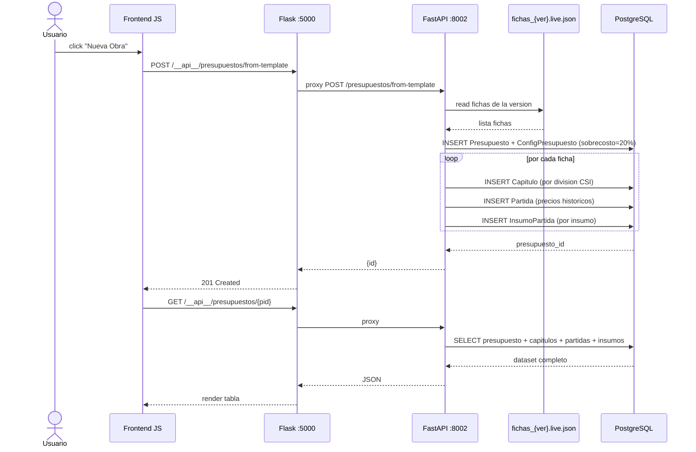
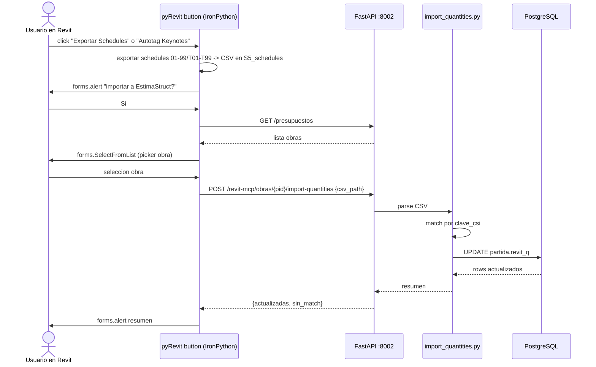
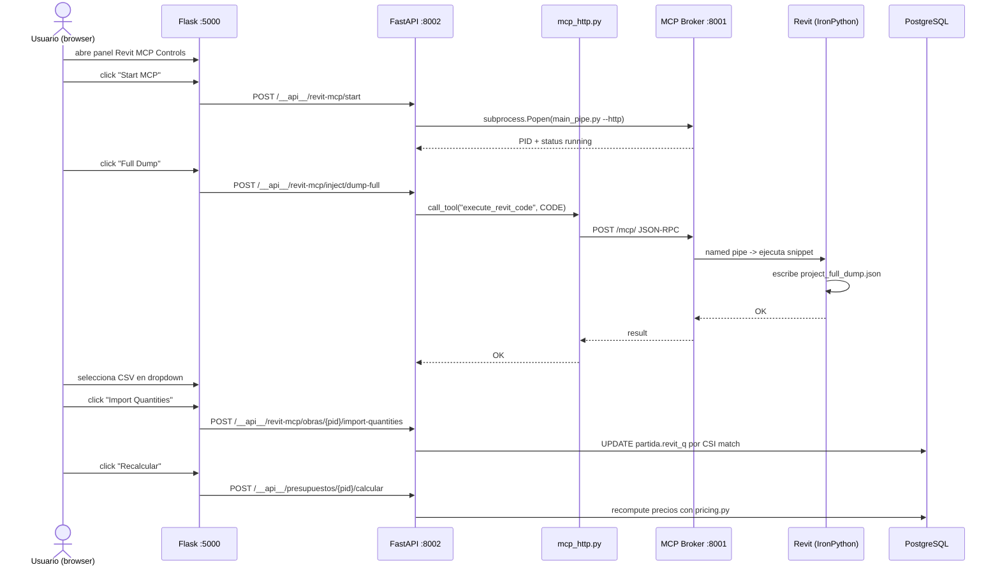
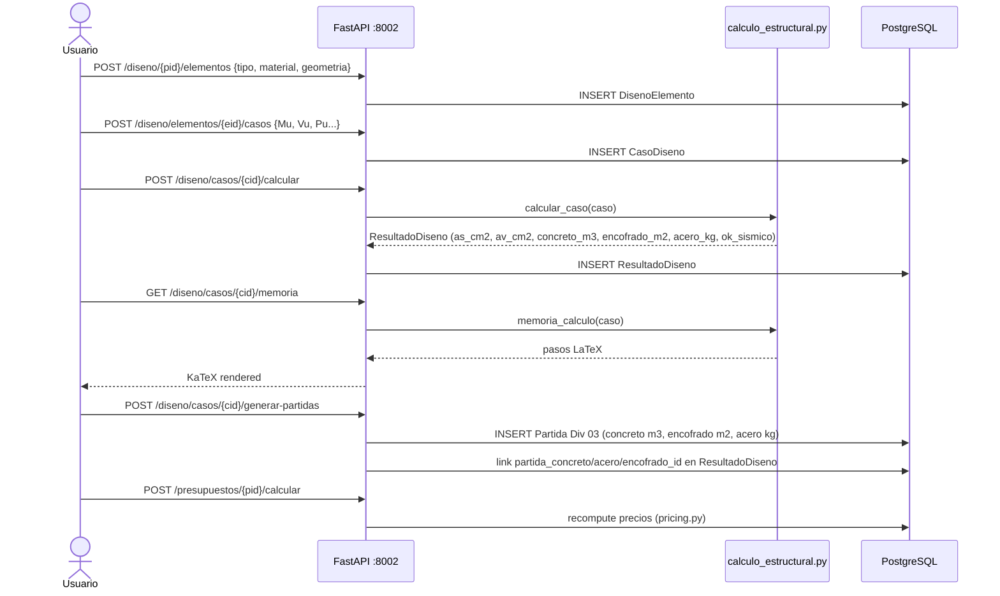
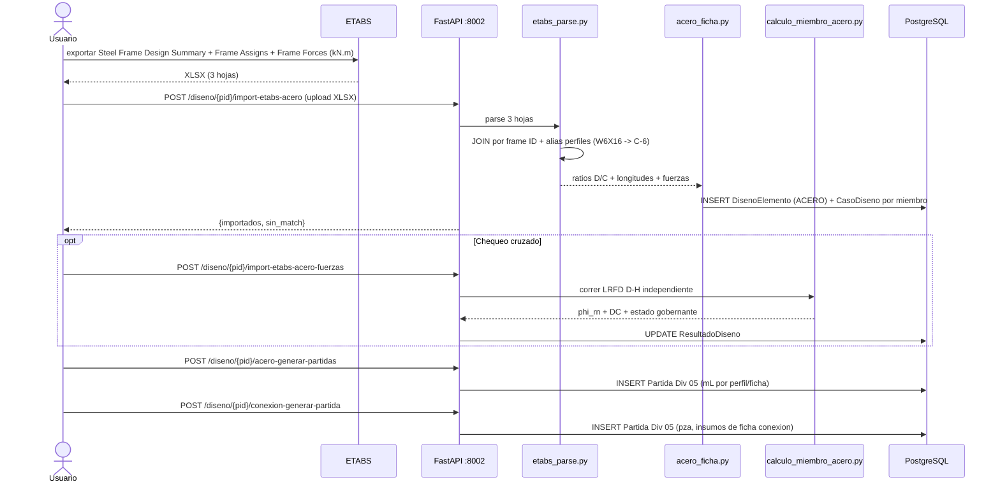
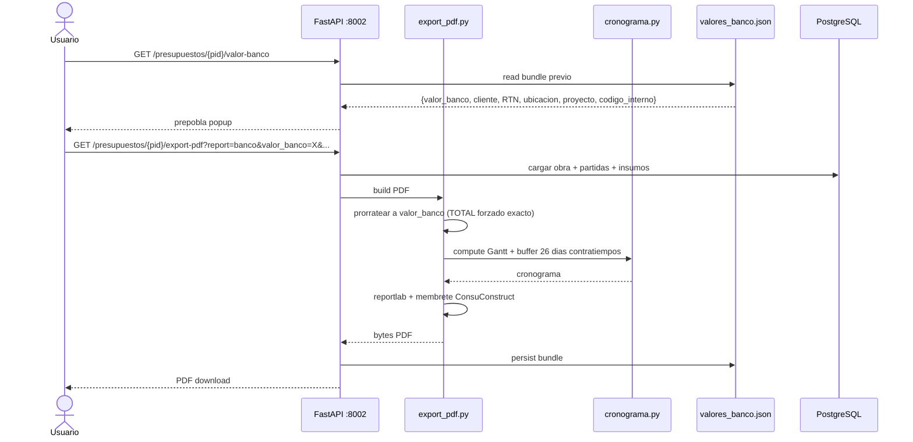
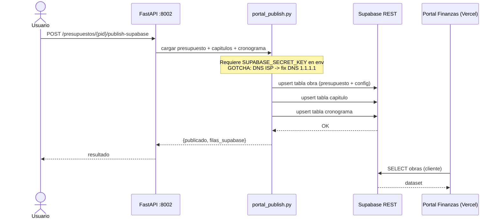
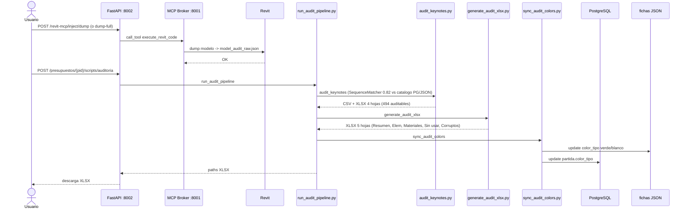
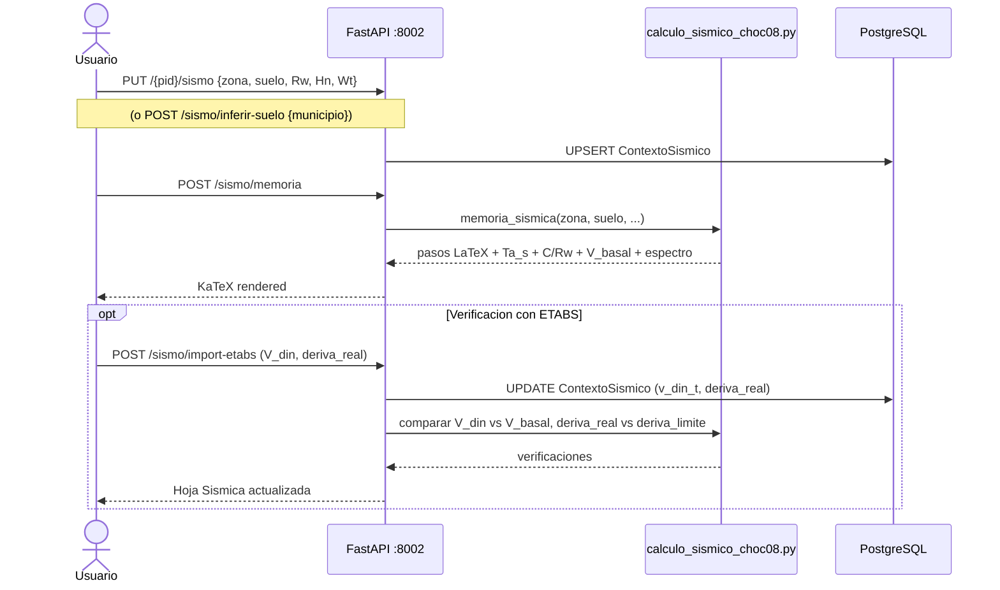
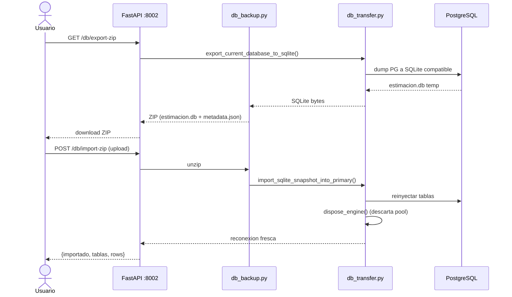

# Architecture — EstimaStruct

> **Estado:** production (local) → **P0 SaaS migration declarada (CASE-SAAS-001)**
> **Versión catálogo:** v1.3 (375 fichas: 359 PG + 16 JSON-only)
> **Última actualización:** 2026-07-21
> **Proyectos relacionados:** Revit MCP Broker (§8), pyRevit extension (§8), Portal Finanzas (§8), ETABS (§8), Brain :8200 (§8 — sin conexión directa)
> **RAG embeddings:** 3,687 chunks 100% Nomic-embedded (backfill completado 2026-07-21) — ADR-008

---

## §1 Context — ¿Qué es y para quién?

EstimaStruct es una app web de presupuestos de construcción para Honduras — en migración a SaaS multi-tenant (CASE-SAAS-001). Sirve al constructor hondureño (David Chinchilla / ConsuConstruct S. de R.L.), al director de obra, al cliente final (vía Portal Finanzas), y — en target SaaS — a constructores externos (web + mobile). Resuelve la fragmentación manual entre OPUS (catálogo de rendimientos), Revit (modelo 3D + cantidades) y Excel (cálculos ad-hoc): unifica el presupuesto a nivel CSI, el diseño estructural (ACI 318-19 + LRFD AISC 360-16 + CHOC-08), el cronograma Gantt, la importación de cantidades desde Revit, y la publicación de obra a un portal de finanzas cliente.

**Target SaaS (P0 confirmado 2026-07-21):** API FastAPI en AWS ECS/Lambda + RDS PostgreSQL; frontend Next.js (web) + PWA/React Native (mobile); Custom EstimaStruct GPT con CAG (corpus 3,687 chunks 100% Nomic 768d embebidos → KV-cache → latencia sub-segundo); auth JWT + OAuth2 + roles admin/cliente/trabajador; OWASP Top 10 obligatorio en cada deploy producción.

### §1.1 System Context Diagram (C4 Level 1)

```plantuml
@startuml context_estimastruct
!include https://raw.githubusercontent.com/plantuml-stdlib/C4-PlantUML/master/C4_Context.puml

title System Context - EstimaStruct (local + SaaS target P0)

Person(constructor, "Constructor hondureno", "David Chinchilla / ConsuConstruct: crea presupuestos, corre disenos, publica al portal")
Person(director, "Director de obra", "Revisa auditorias y aprueba materializaciones")
Person(cliente, "Cliente de obra", "Consume presupuesto y cronograma via Portal Finanzas")
Person(saas_user, "Usuario SaaS externo [P0]", "Constructor externo: accede via web (Next.js) o mobile (PWA/React Native)")

System(estimastruct, "EstimaStruct", "App web de presupuestos: catalogo CSI, motores ACI/LRFD/CHOC-08, cronograma, PDF banco, CAG GPT [P0]")
System_Ext(aws, "AWS [P0]", "ECS/Lambda FastAPI + RDS PostgreSQL + CAG KV-cache")

System_Ext(revit, "Revit (Autodesk)", "Modelo BIM + schedules + keynotes")
System_Ext(pyrevit, "pyRevit extension", "Botones IronPython que llaman a EstimaStruct")
System_Ext(mcp, "Revit MCP Broker", "Bridge JSON-RPC :8001 para snippets IronPython")
System_Ext(etabs, "ETABS", "Analisis y diseno estructural (XLSX)")
System_Ext(opus, "BaseDatosOpus2026.xlsx", "Catalogo maestro de rendimientos OPUS")
System_Ext(portal, "Portal Finanzas", "Next.js Vercel: roles admin/cliente/trabajador")
System_Ext(supabase, "Supabase", "BD del Portal (obra + capitulo + cronograma)")

Rel(constructor, estimastruct, "usa", "HTTPS")
Rel(director, estimastruct, "revisa auditorias", "HTTPS")
Rel(cliente, portal, "consulta", "HTTPS")
Rel(saas_user, aws, "usa [P0]", "HTTPS web/mobile")

Rel(estimastruct, mcp, "controla / inyecta IronPython", "HTTP JSON-RPC")
Rel(mcp, revit, "ejecuta snippets", "named pipe")
Rel(pyrevit, estimastruct, "picker + import quantities", "HTTP inbound")
Rel(estimastruct, etabs, "parse XLSX", "file")
Rel(estimastruct, opus, "import fichas", "file")
Rel(estimastruct, supabase, "publish presupuesto+cronograma", "HTTPS REST")
Rel(portal, supabase, "lee obras", "HTTPS REST")
Rel(estimastruct, aws, "migra a [P0]", "CASE-SAAS-001 ADR-007")
@enduml
```

---

## §2 Goal — Objetivos y restricciones

- **Objetivo principal:** generar presupuestos de construcción detallados a nivel CSI, con diseño estructural verificable (ACI/LRFD/CHOC-08), cronograma Gantt calculado, y publicación end-to-end al Portal Finanzas del cliente.
- **Objetivo P0 SaaS (CASE-SAAS-001, confirmado 2026-07-21):** migrar a producto SaaS multi-tenant con API AWS + frontend web/mobile + Custom EstimaStruct GPT con CAG.
- **Usuarios target:**
  - Constructor hondureño (David Chinchilla) — producción local actual
  - Director de obra
  - Cliente de obra (vía Portal Finanzas)
  - **[P0]** Constructores externos — SaaS web (Next.js) + mobile (PWA/React Native)
- **Restricciones vigentes (local):**
  - [x] Honduras — norma sísmica CHOC-08 (zonas 1/2/3a/3b/4a/4b, suelos S1–S4)
  - [x] Precios en Lempiras (HNL) por defecto
  - [x] Catálogo CSI (00–33) como llave maestra de partidas
  - [x] PostgreSQL primario desde 2026-07-19 (SQLite legacy congelada)
  - [x] Formato XLSX ETABS: 3 hojas (Steel Frame Design Summary + Frame Assigns-Summary + Frame Output-Frame Forces kN.m)
  - [x] Membrete ConsuConstruct en todos los PDFs
  - [x] Prorrateo exacto a valor_banco en PDF banco (total forzado)
  - [x] Cronograma con buffer de 26 días laborales (contratiempos)
- **Restricciones adicionales P0 SaaS (ADR-007):**
  - [ ] OWASP Top 10 — auditoría obligatoria antes de cada deploy producción AWS
  - [ ] Auth: JWT + OAuth2 + roles (admin / cliente / trabajador)
  - [ ] Stack cloud: FastAPI en AWS ECS/Lambda + RDS PostgreSQL
  - [ ] Stack frontend: Next.js (web) + PWA o React Native (mobile)
  - [ ] CAG layer: corpus 3,687 chunks 100% Nomic 768d → KV-cache sub-segundo (ADR-008)
  - [ ] Multi-tenancy: aislamiento de datos por organización en RDS PG

---

## §3 Containers (C4 Level 2)

### §3.1 Container Diagram

```plantuml
@startuml containers_estimastruct
!include https://raw.githubusercontent.com/plantuml-stdlib/C4-PlantUML/master/C4_Container.puml

title Containers - EstimaStruct

Person(user, "Constructor")
Person_Ext(pyrevit_user, "Usuario en Revit", "Ejecuta botones pyRevit")

System_Boundary(estimastruct, "EstimaStruct") {
  Container(flask, "Flask Frontend", "Python Flask 3.x :5000", "SPA HTML/JS + proxy /__api__/* a FastAPI")
  Container(fastapi, "FastAPI Backend", "Python FastAPI + uvicorn :8002", "REST API: presupuestos, calculos, export, cronograma, MCP")
  ContainerDb(pg, "PostgreSQL estimastruct", "PostgreSQL 16 :5432", "BD primaria (obras, partidas, insumos, disenos)")
  ContainerDb(fichas, "Catalogo Fichas JSON", "JSON files", "development/Template2_Updated/{version}/fichas/*.json")
  ContainerDb(mem, "Memoria Tecnica", "SQLite", "backend/technical_memory.db")
  ContainerDb(sqlite_compat, "SQLite UI Compat", "SQLite (opcional)", "estimastruct.db (dashboard legacy)")
  ContainerDb(sqlite_legacy, "SQLite Legacy", "SQLite (deprecated)", "estimacion.db - NO tocar")
  Container(viewer, "Viewer 3D", "Babylon.js template", "GLB + project_full_dump.json")
}

System_Ext(mcp, "Revit MCP Broker", "main_pipe.py --http :8001")
System_Ext(revit, "Revit", "Autodesk BIM")
System_Ext(etabs, "ETABS", "XLSX export")
System_Ext(opus, "BaseDatosOpus2026.xlsx", "OPUS master")
System_Ext(supabase, "Supabase", "REST API")
System_Ext(portal, "Portal Finanzas", "Next.js Vercel :3000")

Rel(user, flask, "navega dashboard", "HTTPS")
Rel(flask, fastapi, "proxy /__api__/*", "HTTP")
Rel(flask, viewer, "sirve /viewer", "HTTP")
Rel(flask, sqlite_compat, "metricas legacy (opcional)", "SQLite")

Rel(pyrevit_user, fastapi, "picker + import-quantities", "HTTP direct")

Rel(fastapi, pg, "asyncpg/psycopg3", "SQL")
Rel(fastapi, fichas, "read/write fichas", "JSON I/O")
Rel(fastapi, mem, "eventos, contextos", "SQLite")
Rel(fastapi, mcp, "start/stop + call_tool", "HTTP JSON-RPC")
Rel(mcp, revit, "inject IronPython", "named pipe")
Rel(fastapi, etabs, "parse XLSX", "file")
Rel(fastapi, opus, "import updater", "file openpyxl")
Rel(fastapi, supabase, "publish obra+cronograma", "HTTPS REST")
Rel(portal, supabase, "lee obras", "HTTPS REST")
@enduml
```

### §3.2 Container Table

| ID | Nombre | Tech | Puerto | Responsabilidad |
|----|--------|------|--------|-----------------|
| flask_frontend | Flask Frontend | Python Flask 3.x | 5000 | SPA HTML/JS + proxy `/__api__/*` → FastAPI; sirve `/viewer`; cache-bust JS/CSS por mtime |
| fastapi_backend | FastAPI Backend | Python FastAPI + SQLAlchemy + uvicorn | 8002 | Toda la lógica de negocio: CRUD, motores estructurales, export, cronograma, MCP, backup |
| postgresql | PostgreSQL estimastruct | PostgreSQL 16 | 5432 | BD primaria desde 2026-07-19 (`ESTIMASTRUCT_DATABASE_URL`) |
| sqlite_legacy | SQLite Legacy | SQLite | — | `C:\EstimaStruct\data\estimacion.db` — NO tocar (formato export ZIP) |
| sqlite_ui_compat | SQLite UI Compat | SQLite | — | `C:\EstimaStruct\data\estimastruct.db` — dashboard legacy opcional |
| sqlite_memory | Memoria Técnica | SQLite | — | `backend/technical_memory.db` — eventos, contextos, notas |
| fichas_json | Catálogo Fichas JSON | JSON files | — | `development/Template2_Updated/{version}/fichas/fichas_{version}.json` (+ `.live.json`, `.bak1..4.json`) |

---

## §4 Components (C4 Level 3)

### §4.1 Backend Components

```plantuml
@startuml components_backend_estimastruct
!include https://raw.githubusercontent.com/plantuml-stdlib/C4-PlantUML/master/C4_Component.puml

title Backend Components - FastAPI :8002

Container_Boundary(api, "FastAPI Backend :8002") {
  Component(r_pres, "Router Presupuestos", "FastAPI Router", "CRUD obras y templates; from-template")
  Component(r_part, "Router Partidas", "FastAPI Router", "CRUD partidas; PATCH cantidad/factores/type_mark/color")
  Component(r_rec, "Router Recursos", "FastAPI Router", "Catalogo maestro de insumos")
  Component(r_ins, "Router Insumos", "FastAPI Router", "Insumos por partida")
  Component(r_calc, "Router Calculos", "FastAPI Router", "/calcular + /reporte")
  Component(r_exp, "Router Export XLSX", "FastAPI + openpyxl", "presupuesto/db/insumos/audit XLSX")
  Component(r_pdf, "Router Export PDF", "FastAPI + reportlab", "PDF membrete: presupuesto/banco/cronograma/insumos/audit")
  Component(r_prev, "Router Preview PDF", "FastAPI + Chromium", "HTML preview + export-pdf-html")
  Component(r_cron, "Router Cronograma", "FastAPI Router", "Gantt JSON + XLSX + overrides cuadrilla")
  Component(r_portal, "Router Portal Publish", "FastAPI + urllib", "Publish Supabase (obra+capitulo+cronograma)")
  Component(r_dis, "Router Diseno Estructural", "FastAPI Router", "Elementos, casos, calcular, memoria, generar partidas Div 03")
  Component(r_sis, "Router Sismo", "FastAPI Router", "CHOC-08: tablas, memoria, espectro, inferir suelo")
  Component(r_acero, "Router Acero Diseno", "FastAPI Router", "Import ETABS acero, generar Div 05, placas base J8")
  Component(r_conx, "Router Conexion Acero", "FastAPI Router", "AISC J: catalogo, memoria rapida, CRUD conexiones")
  Component(r_miem, "Router Miembro Acero", "FastAPI Router", "LRFD D-H memoria rapida en vivo")
  Component(r_bases, "Router Bases", "FastAPI Router", "Editor catalogo fichas + sync + undo")
  Component(r_upd, "Router Updater", "FastAPI + openpyxl", "Import XLSX OPUS -> fichas JSON")
  Component(r_scr, "Router Scripts", "FastAPI Router", "keynotes / auditoria / import-quantities pipeline")
  Component(r_mcp, "Router Revit MCP", "FastAPI Router", "start/stop broker + inject + full-dump + viewer-glb")
  Component(r_diag, "Router Diagnostics", "FastAPI Router", "errors/notifications/status")
  Component(r_mem, "Router Memory", "FastAPI Router", "Memoria tecnica local")
  Component(r_dbk, "Router DB Backup", "FastAPI Router", "export-zip / import-zip (PG<->SQLite)")

  Component(svc_pricing, "Pricing Service", "backend/services/pricing.py", "FUENTE UNICA de calculo de precio (Decimal ROUND_HALF_UP)")
  Component(svc_mcp, "MCP HTTP client", "backend/services/mcp_http.py", "httpx client al broker :8001")
  Component(svc_etabs, "ETABS Parser", "backend/services/etabs_parse.py", "Parse XLSX Steel Frame + Frame Forces")
  Component(svc_bridge, "Partidas Bridge", "backend/services/partidas_bridge.py", "Helpers Partida <-> catalogo")

  Component(eng_aci, "Motor ACI 318-19", "backend/calculo_estructural.py", "Vigas/columnas concreto: flex, cortante, torsion, esbeltez; takeoff Div 03")
  Component(eng_lrfd, "Motor LRFD Miembros", "backend/calculo_miembro_acero.py", "AISC 360-16 D-H (traccion/compresion/flexion/cortante/flexo-comp)")
  Component(eng_conx, "Motor AISC J", "backend/calculo_conexion_acero.py", "Pernos J3 + soldadura J2 + elementos J4 + placa base J8")
  Component(eng_choc, "Motor CHOC-08", "backend/calculo_sismico_choc08.py", "Sismica Honduras: periodo, cortante basal, espectro, derivas")
  Component(eng_cron, "Motor Cronograma", "backend/cronograma.py", "Duraciones por CSI V1.2 x cantidad; XLSX semanas")
  Component(perfiles, "Perfiles Acero", "backend/perfiles_acero.py", "TABLA_W + props_seccion() fuente unica geometrias")

  Component(err, "Error Handler", "backend/error_handler.py", "Global exception -> notifications.log")
  Component(notif, "Silent Notifier", "backend/silent_notifier.py", "Monitor + notifications.log")
}

ContainerDb(pg, "PostgreSQL", "PostgreSQL 16", "BD primaria")

Rel(r_calc, svc_pricing, "usa")
Rel(r_pres, svc_pricing, "usa (from-template)")
Rel(r_part, svc_pricing, "usa (recompute)")
Rel(r_dis, eng_aci, "calcular caso")
Rel(r_dis, svc_bridge, "generar partidas Div 03")
Rel(r_acero, svc_etabs, "parse XLSX")
Rel(r_acero, eng_lrfd, "chequeo cruzado D-H")
Rel(r_conx, eng_conx, "calcular AISC J")
Rel(r_miem, eng_lrfd, "memoria rapida")
Rel(r_sis, eng_choc, "memoria sismica")
Rel(r_cron, eng_cron, "compute Gantt")
Rel(r_mcp, svc_mcp, "call_tool")
Rel(eng_lrfd, perfiles, "props_seccion")
Rel(eng_conx, perfiles, "props_seccion")

Rel(r_pres, pg, "SQL")
Rel(r_part, pg, "SQL")
Rel(r_dis, pg, "SQL")
Rel(r_cron, pg, "SQL")
@enduml
```

### §4.2 Router Index

| Router | Prefix | Archivo | Descripción |
|--------|--------|---------|-------------|
| presupuestos | `/presupuestos` | `backend/routers/presupuestos.py` | CRUD obras + from-template + reasignar-capitulos + sobrecosto |
| partidas | (sin prefix global) | `backend/routers/partidas.py` | CRUD partidas + PATCH cantidad/revit_q/factores/type_mark/color/unidad/csi/descripcion |
| recursos | `/recursos` | `backend/routers/recursos.py` | Catálogo maestro insumos + precio unitario |
| insumos | (sin prefix global) | `backend/routers/insumos.py` | Insumos por partida |
| calculos | (sin prefix global) | `backend/routers/calculos.py` | `/calcular` + `/reporte` |
| export | (sin prefix global) | `backend/routers/export.py` | Export XLSX (presupuesto, db, insumos, audit) |
| export_pdf | (sin prefix global) | `backend/routers/export_pdf.py` | PDF reportlab (`?report=presupuesto|banco|cronograma|insumos|db|audit`) + valor-banco |
| preview_pdf | (sin prefix global) | `backend/routers/preview_pdf.py` | Preview HTML + export-pdf-html (Chromium) |
| cronograma | (sin prefix global) | `backend/routers/cronograma.py` | Gantt JSON + XLSX + overrides personal |
| portal_publish | `/presupuestos` | `backend/routers/portal_publish.py` | Publish + sync-precios Supabase |
| diseno_estructural | `/diseno` | `backend/routers/diseno_estructural.py` | Elementos, casos, calcular, memoria, generar partidas Div 03, mamposteria Div 04 |
| sismo | (sin prefix global) | `backend/routers/sismo.py` | CHOC-08: tablas, memoria, espectro, inferir-suelo, import-etabs |
| acero_diseno | `/diseno` | `backend/routers/acero_diseno.py` | Import ETABS acero (ratios + fuerzas) + generar Div 05 + placas base |
| conexion_acero | `/conexion-acero` | `backend/routers/conexion_acero.py` | AISC §J: catálogo, memoria-rapida, CRUD conexiones, recalcular |
| miembro_acero | `/miembro-acero` | `backend/routers/miembro_acero.py` | LRFD §D-H memoria-rapida en vivo |
| bases | `/bases` | `backend/routers/bases.py` | Editor catálogo fichas + sync + undo (v1.0/v1.1/v1.2/v1.3) |
| updater | `/updater` | `backend/routers/updater.py` | Import XLSX OPUS → fichas JSON + sync-colors |
| scripts | (sin prefix global) | `backend/routers/scripts.py` | keynotes / auditoria / schedules-csvs / import-quantities |
| revit_mcp | `/revit-mcp` | `backend/routers/revit_mcp.py` | Broker start/stop, inject snippets, full-dump, viewer-glb |
| diagnostics | (sin prefix global) | `backend/routers/diagnostics.py` | errors/notifications/status |
| memory | (sin prefix global) | `backend/routers/memory.py` | Memoria técnica local (SQLite technical_memory.db) |
| db_backup | `/db` | `backend/routers/db_backup.py` | export-zip / import-zip (PG↔SQLite compat) |

### §4.3 Key Components Table

| Componente | Archivo | Propósito | Inputs | Outputs |
|------------|---------|-----------|--------|---------|
| Motor ACI 318-19 | `backend/calculo_estructural.py` | Vigas/columnas concreto (flex, cortante, torsión, esbeltez); takeoff Div 03 | b_cm, d_cm, fc, fy, Mu, Vu, Tu, Nu/Pu, Mu_xx/yy, lu, k_x/y | as_cm2, av_cm2, s_max, concreto_m3, encofrado_m2, acero_kg, memoria LaTeX |
| Motor LRFD Miembros | `backend/calculo_miembro_acero.py` | AISC 360-16 §D–H (chequeo cruzado ETABS) | perfil TABLA_W, acero (A992/A36/A500), longitud, k, Pu, Mu, Vu | φRn por estado, gobernante, DC, cumple, memoria LaTeX |
| Motor AISC §J | `backend/calculo_conexion_acero.py` | Pernos §J3, soldadura §J2, elementos §J4, placa base §J8 | tipo, perno_grado/d/n, w_filete, L_sold, Vu, Nu, Mu, Pu, B/N placa, fc | φRn por estado, gobernante, DC, `estados_json`, `j8_json`, memoria LaTeX |
| Motor CHOC-08 | `backend/calculo_sismico_choc08.py` | Sísmica Honduras: periodo (Método A), C/Rw, V basal, espectro, derivas | zona 1–4b, suelo S1–S4, Rw, I, Hn, Wt | Ta_s, V_basal_t, espectro `[[T, a_g]]`, memoria, inferencia municipio→zona |
| Pricing Service | `backend/services/pricing.py` | **FUENTE ÚNICA** de precio partida (elimina duplicación 4 routers) | insumos, sobrecosto % | costo_mo, costo_ma, unitario_matriz, costo_base, precio_unitario, total (Decimal ROUND_HALF_UP 4 dec) |
| Motor Cronograma | `backend/cronograma.py` | Gantt: duración = ceil(dias_unidad[CSI] × cantidad) | partidas + overrides cuadrilla | fecha_inicio/fin, duracion_dias, fase, colores; 6 días laborales/sem |
| MCP HTTP Client | `backend/services/mcp_http.py` | httpx client al broker :8001 (follow_redirects=True) | tool_name, arguments | resultado JSON-RPC |
| ETABS Parser | `backend/services/etabs_parse.py` | Parse XLSX 3 hojas + alias perfiles (W6X16→C-6) | XLSX Steel Frame | JOIN por frame ID: ratios D/C + longitudes + fuerzas |
| Perfiles Acero | `backend/perfiles_acero.py` | TABLA_W + `props_seccion()` (Ix/Sx/Zx/rx/ry/J/Cw/ho/rts) + detección HSS | perfil, geometría | props sección para motores acero |
| PDF Export | `backend/routers/export_pdf.py` | reportlab + membrete ConsuConstruct; prorrateo valor_banco exacto; Gantt buffer 26 días | tipo, valor_banco, cliente, RTN, ubicación | PDF; persiste bundle en `valores_banco.json` |
| Viewer 3D | `ESTIMASTRUCT/templates/viewer.html` | Babylon.js standalone; consume `project_full_dump.json` v2 via `/__api__/revit-mcp/full-dump` (Flask directo, sin FastAPI); paneles Niveles/Materiales/Ambientes/Capas; filtro nivel; info panel en pick de mesh; dump_v2 = 2.37 MB, 8 niveles, 2344 instancias (todos params), 719 mat (369 con textura), 101 compound | `project_full_dump.json` v2 + GLB (pendiente OBJ export pyRevit) | paneles data OK; canvas Babylon.js + GLB pipeline pendiente (CASE-VIEWER-001) |

---

## §5 Flows — Flujos principales

### §5.1 Flow: Crear presupuesto desde template



### §5.2 Flow: Import cantidades desde Revit (flujo pyRevit)



### §5.3 Flow: Import cantidades desde Revit (flujo web UI)



### §5.4 Flow: Diseño estructural y generación de partidas Div 03



### §5.5 Flow: Import acero desde ETABS y generación Div 05



### §5.6 Flow: Generar PDF banco



### §5.7 Flow: Publicar cronograma a Portal



### §5.8 Flow: Audit pipeline Revit CSI



### §5.9 Flow: Calcular sísmica CHOC-08



### §5.10 Flow: Backup y restore de BD



---

## §6 Data Model

### §6.1 Entity Relationship

```mermaid
erDiagram
  PRESUPUESTO {
    UUID id PK
    string nombre
    string cliente
    date fecha
    string moneda
    bool es_template
    datetime created_at
  }
  CONFIG_PRESUPUESTO {
    UUID presupuesto_id PK_FK
    float sobrecosto
    float administracion
    float utilidad
    float imprevistos
    float iva
    float otros_factor
    string template_version
  }
  CAPITULO {
    int id PK
    UUID presupuesto_id FK
    string clave
    string nombre
    int orden
  }
  PARTIDA {
    int id PK
    int capitulo_id FK
    string clave_csi
    string descripcion
    string unidad
    float cantidad
    float costo_mo
    float costo_ma
    float unitario_matriz
    float costo_base
    float precio_unitario
    float total
    float revit_q
    float factor_e
    float factor_f
    string color_tipo
    bool es_formula
    string type_mark
    string omniclass_num
    string assembly_num
    int orden
  }
  INSUMO_PARTIDA {
    int id PK
    int partida_id FK
    int recurso_id FK
    string clave
    string descripcion
    string unidad
    string tipo
    float cantidad
    float costo_unit
    float total
    int orden
  }
  RECURSO {
    int id PK
    string clave
    string descripcion
    string unidad
    string tipo
    float precio_unitario
    datetime ultima_actualizacion
  }
  DISENO_ELEMENTO {
    int id PK
    UUID presupuesto_id FK
    string csi
    string type_mark
    string tipo
    string material_tipo
    string perfil_acero
    string acero_grado
    float b_cm
    float d_cm
    float fc_kg_cm2
    float fy_kg_cm2
    float longitud_m
  }
  CASO_DISENO {
    int id PK
    int diseno_elemento_id FK
    string nombre
    bool gobierna
    string origen
    string combo_etabs
    float mu_tm
    float vu_t
    float tu_tm
    float nu_t
    float pu_t
    float mu_xx_tm
    float mu_yy_tm
    float lu_cm
    float k_x
    float k_y
  }
  RESULTADO_DISENO {
    int id PK
    int caso_id FK
    float as_cm2
    float a_prima_cm2
    float av_cm2
    float at_cm2
    float concreto_m3
    float encofrado_m2
    float acero_kg
    float estribos_kg
    bool ok_sismico
    bool ok_pg
    string acero_estado_gob
    float acero_phi_rn_gob
    float acero_dc
    bool acero_cumple
    int partida_concreto_id
    int partida_acero_id
    int partida_encofrado_id
  }
  CONTEXTO_SISMICO {
    UUID presupuesto_id PK_FK
    string norma
    string municipio
    string zona
    float z_factor
    string suelo
    float s_coef
    float ta_s
    float tb_s
    float importancia_i
    float rw
    float deriva_limite
    float hn_m
    float w_t
    float v_din_t
    float deriva_real
    json espectro_json
  }
  CONEXION_ACERO {
    int id PK
    UUID presupuesto_id FK
    string csi
    string type_mark
    string tipo_conexion
    string perfil_viga
    string perfil_columna
    float t_placa_cm
    string perno_grado
    float perno_d_cm
    int n_pernos
    float w_filete_cm
    float B_placa_cm
    float N_placa_cm
    int partida_id
  }
  CONEXION_CASO {
    int id PK
    int conexion_id FK
    string nombre
    bool gobierna
    string origen
    string combo_etabs
    float vu_t
    float nu_t
    float mu_tm
    float pu_t
  }
  CONEXION_RESULTADO {
    int id PK
    int caso_id FK
    string estado_gob
    float phi_rn_gob
    float demanda_t
    float dc
    bool cumple
    json estados_json
    json j8_json
  }
  CRONOGRAMA_OVERRIDE {
    int id PK
    UUID presupuesto_id FK
    int partida_id FK
    int n_esp
    int n_ay
  }

  PRESUPUESTO ||--|| CONFIG_PRESUPUESTO : "1:1 config"
  PRESUPUESTO ||--o{ CAPITULO : "tiene"
  CAPITULO ||--o{ PARTIDA : "tiene"
  PARTIDA ||--o{ INSUMO_PARTIDA : "tiene"
  RECURSO ||--o{ INSUMO_PARTIDA : "cataloga"
  PRESUPUESTO ||--o{ DISENO_ELEMENTO : "diseno"
  DISENO_ELEMENTO ||--o{ CASO_DISENO : "casos"
  CASO_DISENO ||--|| RESULTADO_DISENO : "resultado"
  PRESUPUESTO ||--|| CONTEXTO_SISMICO : "1:1 sismo"
  PRESUPUESTO ||--o{ CONEXION_ACERO : "conexiones"
  CONEXION_ACERO ||--o{ CONEXION_CASO : "casos"
  CONEXION_CASO ||--|| CONEXION_RESULTADO : "resultado"
  PRESUPUESTO ||--o{ CRONOGRAMA_OVERRIDE : "overrides"
  PARTIDA ||--o| CRONOGRAMA_OVERRIDE : "override cuadrilla"
  RESULTADO_DISENO }o--|| PARTIDA : "concreto/acero/encofrado FK"
  CONEXION_ACERO }o--|| PARTIDA : "Div 05 FK"
```

### §6.2 Table Index

| Tabla | Propósito | Relaciones clave |
|-------|-----------|-----------------|
| `presupuesto` | Obra o template (`es_template=True`) | 1:1 config; 1:N capítulos; 1:N diseno; 1:1 sismo; 1:N conexiones |
| `config_presupuesto` | Financiero: sobrecosto, admin, utilidad, imprevistos, IVA | 1:1 presupuesto |
| `capitulo` | División CSI (00–33) por obra | N:1 presupuesto; 1:N partida |
| `partida` | Línea de presupuesto (precios históricos, cantidad, revit_q, factores, color) | N:1 capítulo; 1:N insumos |
| `insumo_partida` | Insumo con tipo (MATERIAL/MANO_OBRA/EQUIPO/…) | N:1 partida; N:1 recurso (nullable) |
| `recurso` | Catálogo maestro (precio unitario) | 1:N insumos |
| `diseno_elemento` | Viga/columna concreto o acero LRFD | N:1 presupuesto; 1:N casos |
| `caso_diseno` | Caso de carga (MANUAL o ETABS) | N:1 elemento; 1:1 resultado |
| `resultado_diseno` | Takeoff Div 03 + verificaciones + LRFD acero | 1:1 caso; FK a 3 partidas |
| `contexto_sismico` | Parámetros CHOC-08 por obra | 1:1 presupuesto |
| `conexion_acero` | AISC §J: pernos, soldadura, placa base | N:1 presupuesto; 1:N casos; FK partida Div 05 |
| `conexion_caso` | Caso de carga de conexión | N:1 conexión; 1:1 resultado |
| `conexion_resultado` | φRn por estado + DC + `estados_json` + `j8_json` | 1:1 caso |
| `cronograma_override` | Cuadrillas custom por partida | N:1 presupuesto; 1:1 partida |

---

## §7 Actual State

### §7.1 Active Features (producción)
- CRUD presupuestos / capítulos / partidas / insumos / recursos
- Motor de precios (`pricing.py`) con Decimal ROUND_HALF_UP — fuente única
- Cálculos estructurales: ACI 318-19 (vigas/columnas concreto), LRFD AISC 360-16 (miembros + conexiones §J), CHOC-08 (sísmica Honduras)
- Import ETABS: acero (3 hojas XLSX) + concreto + sísmica
- Import cantidades Revit vía pyRevit (IronPython) o web UI
- Audit pipeline Revit CSI: dump → `audit_keynotes` → XLSX → `sync_audit_colors`
- Cronograma Gantt con duraciones por CSI V1.2 + export XLSX
- Export PDF membrete ConsuConstruct (presupuesto, banco, cronograma, insumos, audit)
- Publicación a Supabase (Portal Finanzas)
- Panel Revit MCP Controls integrado en dashboard
- Viewer 3D Babylon.js en `/viewer` — paneles Niveles/Materiales/Ambientes/Capas con datos reales Revit (dump_v2: 719 materiales con texturas, 2344 instancias) — CASE-VIEWER-001 🟡 canvas+GLB pendiente
- Catálogo fichas v1.3 (375 partidas: 359 PG + 16 JSON-only)
- PostgreSQL como BD primaria (migrado 2026-07-19)
- Backup/restore ZIP compatible SQLite ↔ PostgreSQL
- Proxy same-origin Flask → FastAPI (`/__api__/*`)
- Detección automática de dialectos BD (SQLite/PostgreSQL)
- **RAG / CAG corpus:** 3,687 chunks 100% Nomic 768d embebidos (backfill completado 2026-07-21: 568 chunks ESTIMATING/BIM/audit/insumos/schema faltantes corregidos); rutas semánticas ESTIMATING(1532)/PROJECTS(741)/STRUCTURAL(566)/BIM(444)/RAG(443)/MCP(162); IVFFLAT listas=60 probes=20 — base para ADR-008 CAG layer

### §7.2 Known Gaps (pendiente)
- **CASE-VIEWER-001:** Viewer 3D — canvas Babylon.js + GLB pipeline: no hay OBJ export desde pyRevit aún; `viewer_postprocess.py` escrito pero sin ejecutar; CDN Babylon.js (sin vendor local)
- **CASE-REVIT-MCP-001:** Biblioteca de snippets IronPython pendiente
- `valores_banco.json` pendiente migrar a Supabase (persistencia por obra)
- **HSS profiles:** motor acero §E/§F omitidos (solo I-shapes implementados)
- **Torsión ACI 318-19 §22.7:** modelo tubo pared delgada pendiente (implementado §11.6 1971)
- **P1-PDF-BANCO:** `export_pdf._costos_obra` puede omitir `unitario_matriz` en costo directo PDF banco (diverge de `pricing.calc_base` — decisión Director pendiente)
- **P2-TESTS:** 0 tests automatizados en todo el proyecto (auditoría 2026-07-12)
- N+1 en duplicar presupuesto (flush por fila) y `reasignar_capitulos` (COUNT en loop)
- DNS ISP puede no resolver Supabase (workaround: DNS 1.1.1.1)
- `AUTO_CREATE_SCHEMA=false` en modo PG: requiere Alembic para cambios de schema
- 13 fichas stub sin costear (import cantidades sin schedule de materiales/secciones)
- Partidas `05 31 13.3` y `08 51 13.4`: decisión Director pendiente si promover a PG
- Doble `_csi_sort_key` en codebase (`presupuestos.py` y otro router)

### §7.3 Open Cases

| Case | Descripción | Estado |
|------|-------------|--------|
| **CASE-SAAS-001** | **EstimaStruct SaaS: web+mobile+AWS API+CAG GPT+OWASP** | 🔴 **P0 declarado 2026-07-21** |
| CASE-VIEWER-001 | Viewer 3D Babylon.js integrado en EstimaStruct: consume `project_full_dump.json` v2 (Revit real — niveles, materiales+texturas RGB, 2344 instancias con params, capas compuestas); paneles Niveles/Materiales/Ambientes/Capas; filtro por nivel; canvas Babylon.js para GLB; serve `/viewer` en Flask :5000; data vía `/__api__/revit-mcp/full-dump` directo (Flask fallback sin FastAPI) | 🟡 data OK — Babylon.js canvas + GLB pipeline pendiente |
| CASE-REVIT-MCP-001 | Biblioteca snippets IronPython con UI panel | 🔴 pendiente |
| CASE-ACERO-001 | Import ETABS Steel Frame → Div 05 (8 fixes) | 🟢 cerrado 2026-07-17 |
| CASE-MARKS-001 | Botón canónico Sync Marks + Autotag + Export | 🟢 cerrado 2026-07-19 |
| CASE-MAT-001 | Contrato materialización Revit (105 REPLACE_SAFE + 39 REVIEW) | 🟢 CSV 2026-07-17 |
| CASE-LAB-UI-001 | Lab aislado materiales Revit | ⛔ desmantelado 2026-07-17 |
| P1-PDF-BANCO | Divergencia `_costos_obra` vs `pricing.calc_base` | 🟡 decisión Director |
| P2-TESTS | 0 tests automatizados | 🔴 crítico |

---

## §8 Connections to Other Projects

| Proyecto | Tipo conexión | Puerto/URL | Archivos | Ref |
|----------|--------------|------------|----------|-----|
| Revit MCP Broker | HTTP subprocess + JSON-RPC (outbound) | `:8001` | `backend/services/mcp_http.py`, `backend/routers/revit_mcp.py`, `D:\GitHub\revit-estimastruct-audit\mcp_server\main_pipe.py` | §3.1, §5.3, §5.8 |
| pyRevit extension (EstimBot.extension) | HTTP inbound (IronPython → FastAPI) | `:8002` | AppData (no git): `Autotag Keynotes.pushbutton/script.py`, `Exportar Schedules.pushbutton/script.py` | §5.2 |
| Portal Finanzas (Vercel Next.js) | Outbound HTTP REST vía Supabase | `:3000` (Vercel) | `backend/routers/portal_publish.py` | §5.7 |
| ETABS (Computers and Structures) | File export XLSX | — | `backend/services/etabs_parse.py`, `backend/acero_ficha.py`, `backend/etabs_procedimiento.py`, `backend/seccion_ficha.py`, `backend/routers/acero_diseno.py`, `backend/routers/diseno_estructural.py` | §5.5 |
| Revit (Autodesk) | Bidireccional vía MCP bridge :8001 | `:8001` | `backend/services/mcp_http.py`, `backend/scripts_runner/revit_dump_snippet.py`, `revit_full_dump_snippet.py`, `revit_marks_master.py`, `generate_keynotes.py` | §5.3, §5.8 |
| BaseDatosOpus2026.xlsx | Data source (file, inbound) | — | `D:\OneDrive\Bots\Estimbot\MasterFiles\BaseDatosOpus2026.xlsx`, `backend/routers/updater.py` | §4.2 (updater) |
| Supabase | Outbound HTTP REST | `https://humdvodaanyduqxojoxp.supabase.co` | `backend/routers/portal_publish.py` | §5.7 |
| Brain :8200 | **Sin conexión directa** | — | — | contexto Director |

---

## §9 ADR — Architecture Decision Records

### ADR-001: Flask como proxy same-origin vs CORS directo

**Status:** Accepted
**Date:** 2026-07-16
**Context:** El frontend JS en el browser necesita llamar a FastAPI. CORS desde LAN complica la configuración de cookies, requiere pre-flight OPTIONS, y rompe con IPs dinámicas de la red local.
**Decision:** Flask :5000 sirve HTML y hace proxy de `/__api__/*` → FastAPI :8002 (método, params, headers, cookies).
**Consequences:**
- Single origin simplifica auth cookies y elimina CORS.
- Flask queda sin lógica de negocio (solo proxy + assets + `/viewer`).
- pyRevit **bypasa Flask** y llama FastAPI directo (`:8002`) porque IronPython no tiene el mismo contexto de browser.
- Se agrega fallback local para `/__api__/revit-mcp/full-dump` (sirve `project_full_dump.json` sin pasar por FastAPI).

### ADR-002: PostgreSQL primario, SQLite legacy

**Status:** Accepted
**Date:** 2026-07-19
**Context:** SQLite en OneDrive causaba corrupción de WAL durante sync. Performance limitada al crecer el catálogo (v1.3 = 375 fichas, 6 obras, 1137 partidas, 7340 insumos). Concurrencia limitada con múltiples workers uvicorn.
**Decision:** Migrar a PostgreSQL 16 local (`127.0.0.1:5432`, DB `estimastruct`). Migración via `migrate_sqlite_to_postgres.py`. SQLite legacy (`C:\EstimaStruct\data\estimacion.db`) congelada — NO tocar.
**Consequences:**
- `psycopg3` (`psycopg[binary]`) como driver.
- `ESTIMASTRUCT_DATABASE_URL` como variable de env.
- `START_POSTGRES_UNICA.ps1` como launcher oficial (NO `START_UNICA.ps1` que usa SQLite legacy).
- `AUTO_CREATE_SCHEMA=false` en modo PG — requiere Alembic para migraciones (§7.2 gap).
- `db_backup.py` mantiene compat exportando SQLite desde PG y reimportando (portable).
- Detección automática de dialecto: código usa `db.py` que abstrae SQLite/PG.
- Credenciales en `D:\Secrets\postgres_credentials.txt`.

### ADR-003: Pricing Service centralizado (fuente única)

**Status:** Accepted
**Date:** 2026-07-03
**Context:** La fórmula de precio de partida estaba **duplicada en 4 routers** (`presupuestos`, `partidas`, `calculos`, `export_pdf`). El bug del doble conteo de `unitario_matriz` en `/calcular` (2026-07-03) surgió porque una copia agregaba el matriz al `costo_base` mientras otra ya lo incluía. Divergencia potencial de decimales entre routers.
**Decision:** Extraer toda la lógica de precio a `backend/services/pricing.py` como **fuente única**. Bucketing canónico de 3 vías (MO / MATERIAL / otros → `unitario_matriz`). Uso de `Decimal` con `ROUND_HALF_UP` a 4 decimales para determinismo entre PG y SQLite.
**Consequences:**
- Un solo lugar para cambios de fórmula.
- Determinismo cross-BD (PG `NUMERIC` vs SQLite `REAL`).
- P1-PDF-BANCO (§7.3) queda como divergencia conocida: `export_pdf._costos_obra` aún tiene rama propia que puede omitir `unitario_matriz` — pendiente decisión Director.
- `routers/calculos.py`, `routers/presupuestos.py` (`from-template`), `routers/partidas.py` (recompute) importan de `services/pricing.py`.

### ADR-004: ETABS Import via 3-hoja JOIN por Frame ID

**Status:** Accepted
**Date:** 2026-07-17
**Context:** ETABS exporta el diseño de acero disperso en 3 hojas XLSX: (1) **Steel Frame Design Summary** (ratios D/C, perfil recomendado), (2) **Frame Assigns - Summary** (longitudes, perfil asignado, story), (3) **Frame Output - Frame Forces (kN.m)** (fuerzas por combo). Ninguna hoja sola tiene el dato completo. Además ETABS usa nombres imperiales (W6X16) mientras el catálogo hondureño usa nomenclatura C-6.
**Decision:** `etabs_parse.py` hace **JOIN por `frame ID`** de las 3 hojas, aplica alias de perfiles (`W6X16 → C-6`), normaliza `Program Determined → ""`. La capa `acero_ficha.py` genera `DisenoElemento (ACERO) + CasoDiseno` por miembro. Endpoint separado `import-etabs-acero-fuerzas` corre LRFD §D-H independiente como **chequeo cruzado** contra el resultado de ETABS.
**Consequences:**
- Requiere que las 3 hojas estén presentes en el XLSX (validado antes del parse).
- Alias de perfiles centralizados en `perfiles_acero.py` (fuente única de geometrías).
- El chequeo cruzado LRFD detecta divergencias entre ETABS y motor propio (útil cuando ETABS usa versión de norma distinta o `Program Determined`).
- Placas base van por endpoint separado (`/diseno/{pid}/placas-base-etabs`) con formato de reacciones distinto.

### ADR-005: Broker Revit MCP como subproceso HTTP (no in-process)

**Status:** Accepted
**Date:** 2026-07-16
**Context:** Necesitamos ejecutar IronPython en Revit desde el backend Python 3 (`asyncio`). IronPython 2.7 no es cargable in-process en CPython 3.x. Además el broker MCP tiene su propia loop y named pipe a Revit.
**Decision:** El broker vive en otro repo (`D:\GitHub\revit-estimastruct-audit\mcp_server\main_pipe.py`) y se lanza como **subproceso HTTP** (`subprocess.Popen(main_pipe.py --http)`) escuchando en `:8001`. El cliente Python (`services/mcp_http.py`) usa `httpx` con `follow_redirects=True` (fix para redirect 307). Router `revit_mcp.py` expone start/stop/status/call desde el frontend.
**Consequences:**
- Aislamiento de crashes (si el broker cae, FastAPI sigue vivo).
- El usuario controla el broker desde el panel Revit MCP Controls en el dashboard.
- Overhead de HTTP en cada `execute_revit_code`, pero aceptable para operaciones batch (dump, marks, keynotes).
- Necesita Revit abierto para que el named pipe conecte — health check propio (`/revit-mcp/health` hace round-trip real JSON-RPC).
- Scripts Python offline (audit, fichas, keynotes, viewer postprocess) NO usan el broker — corren directo en el backend con `subprocess`.

### ADR-006: Catálogo Fichas JSON versionado en archivo (`v1.0..v1.3`)

**Status:** Accepted
**Date:** 2026-07-21 (v1.3 vigente)
**Context:** Los precios y rendimientos evolucionan por versión. Necesitamos poder crear obras desde una versión específica, revertir cambios, y propagar precios a obras existentes.
**Decision:** Catálogo en `development/Template2_Updated/{version}/fichas/fichas_{version}.json` con `.live.json` como copia editable y `.bak1..bak4.json` como backups rotantes. Router `bases.py` maneja sync (propagar precios a obras que usen la versión) y undo (restaurar backup). v1.3 = 375 fichas: 359 CSI en PG + 16 solo-JSON (partidas que aún no se promueven).
**Consequences:**
- Versionable por git (los `.json` viven en el repo).
- Sync explícito (no auto-propagación) — evita cambios accidentales masivos.
- 16 fichas JSON-only quedan como pending decisión Director (`05 31 13.3`, `08 51 13.4`, etc.).
- Backup 4 niveles cubre errores de edición.
- Duplicación potencial PG ↔ JSON — mitigado con `generate_fichas_v13.py` (rebuild desde PG + merge JSON-only).

### ADR-007: Migración local → SaaS AWS (CASE-SAAS-001)

**Status:** Proposed
**Date:** 2026-07-21
**Context:** EstimaStruct corre local (Flask :5000 + FastAPI :8002 + PG :5432). P0 estratégico confirmado: producto SaaS multi-tenant para constructores externos, web + mobile, API en nube.
**Decision:** Migrar API a **FastAPI en AWS ECS/Lambda** + **RDS PostgreSQL** como BD cloud. Frontend web en **Next.js** (reemplaza Flask); mobile via **PWA o React Native** compartiendo la misma API. Auth con **JWT + OAuth2 + roles** (admin/cliente/trabajador). **OWASP Top 10** obligatorio en cada deploy producción (no opcional). Stack local (Flask+FastAPI+PG local) se mantiene para desarrollo hasta que cloud esté validado.
**Consequences:**
- Multi-tenancy requiere aislamiento por organización en RDS (schema por tenant o FK org_id en cada tabla — decisión pendiente).
- `valores_banco.json` debe migrar a RDS (ya identificado como §7.2 gap).
- `START_POSTGRES_UNICA.ps1` sigue siendo el launcher local; no se depreca hasta que cloud esté en prod.
- OWASP audit es gate obligatorio — ningún deploy a producción sin audit sign-off.
- CAG layer (ADR-008) se despliega junto con la API cloud para que el Custom GPT sea accesible vía API key.
- Prioridad de frentes: (1) FastAPI cloud + RDS + auth JWT, (2) OWASP audit, (3) Next.js web, (4) PWA/React Native mobile.

### ADR-008: CAG Layer — Custom EstimaStruct GPT con KV-cache

**Status:** Proposed
**Date:** 2026-07-21
**Context:** 3,687 chunks de corpus EstimaStruct (ESTIMATING 1,532 + PROJECTS 741 + STRUCTURAL 566 + BIM 444 + RAG 443 + MCP 162) están 100% embebidos con Nomic 768d en `consuconstruct.rag.chunks`. El corpus de actividades, materiales y auditorías BIM es **estable** (no cambia a diario). RAG per-query tiene latencia de ~500ms por llamada Nomic + pgvector scan.
**Decision:** Implementar **CAG (Cache-Augmented Generation)**: corpus estable se carga una vez en el contexto del LLM → KV-cache → latencia sub-segundo por consulta sin retrieval. Equivalente a un Custom GPT industrial pero con control total de chunking, embeddings, vector DB y herramientas. El Custom EstimaStruct GPT usa: chunking semántico Nomic 768d + pgvector + grafo rutas semánticas + MCP agents (Revit 52+ tools + ETABS). Convive con RAG clásico (datos frecuentemente cambiantes: leads, surveys, knowledge nuevo) y SARA SQL Agent (datos dinámicos: costos vivos, inventarios, CRM).
**Consequences:**
- Eliminación de retrieval per-query para el corpus estable → latencia sub-segundo.
- El corpus CAG (ESTIMATING + BIM audit) requiere re-ingesta completa cuando se actualiza el catálogo (no continua).
- SARA (SQL-Augmented RAG Agent): Python → SQL → PG → tablas → reasoning; para datos dinámicos — **no se reemplaza** con CAG, viven juntos.
- RAG clásico sigue activo para datos que cambian frecuentemente.
- KV-cache depende del modelo LLM target (Anthropic Claude con prompt caching, o equivalente en AWS Bedrock).
- GraphAudit (Streamlit+UMAP+Plotly :8503) es la herramienta de monitoreo de salud semántica del corpus.

---

## §10 Update Protocol

Este documento se actualiza cuando:
- Nuevo router agregado → **§4.2**
- Nueva integración externa → **§8**
- Decisión arquitectural → **§9** (ADR nuevo, no editar los anteriores)
- Cambio en flujo → **§5**
- Cambio de estado de feature → **§7**
- Cambio de schema de BD → **§6**

**NO reemplaza:** `CHANGELOG.md` (historial temporal). Este documento es **estado actual**, no historial.

**Ref numbers:** cuando el `CHANGELOG.md` mencione un cambio arquitectural, referenciar `[architecture.md §N]` en lugar de re-explicar la arquitectura.

**JSON fuente:** `docs/architecture_investigation.json` — regenerable con el agente investigador Sonnet. Este `architecture.md` se re-genera con el agente arquitecto Opus a partir del JSON.
